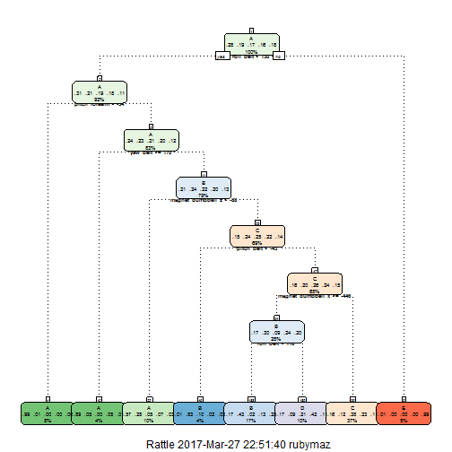

## Goal
One thing that people regularly do is quantify how much of a particular activity they do, but they rarely quantify how well they do it. The goal of this project will be to use data from accelerometers on the belt, forearm, arm, and dumbell of 6 participants and predict the manner in which they did the exercise. 

## Data

The training data for this project are available here:

https://d396qusza40orc.cloudfront.net/predmachlearn/pml-training.csv

The test data are available here:

https://d396qusza40orc.cloudfront.net/predmachlearn/pml-testing.csv

# # Loading the Data and Required Packages

The first step is to load the data.


```r
setwd("C:/Users/rubymaz/Desktop")
training<-read.table("./pml-training.csv", header=TRUE, sep=",")
testing<-read.table("./pml-testing.csv",header=TRUE, sep=",")
library(caret)
## Warning: package 'caret' was built under R version 3.1.2
## Loading required package: lattice
## Loading required package: ggplot2
library(rattle)
## Warning: package 'rattle' was built under R version 3.1.2
## Rattle: A free graphical interface for data mining with R.
## Version 3.4.1 Copyright (c) 2006-2014 Togaware Pty Ltd.
## Type 'rattle()' to shake, rattle, and roll your data.
library(gridExtra)
## Loading required package: grid
```

## Cleaning the training data sets

The data provided has many variables with missing data as well as information that is not relevant to the question being analyzed. Relevant variables are extracted using pattern recognition for relevant strings, leaving 52 variables.


## Cleaning up Test Data
Test data is cleaned now


```r
testingaccel<-grepl("^accel",names(testing))
testingtotal<-grepl("^total",names(testing))
troll<-grepl("^roll",names(testing))
tpitch<-grepl("^pitch",names(testing))
tyaw<-grepl("^yaw",names(testing))
tmagnet<-grepl("^magnet",names(testing))
tgyro<-grepl("^gyro",names(testing))
tacceldata<-testing[ ,testingaccel]
trolldata<-testing[ ,troll]
tpitchdata<-testing[,tpitch]
tyawdata<-testing[,tyaw]
tmagnetdata<-testing[,tmagnet]
tgyrodata<-testing[,tgyro]
ttotaldata<-testing[,testingtotal]
testClasse<-cbind(tacceldata,trolldata,tpitchdata,tyawdata,tmagnetdata,tgyrodata,ttotaldata,testing[ ,160])
colnames(testClasse)[53]<-'problem.id'
```

## Making Training & Testing Subset

A training subset is created with 60% of the original training data set to be used for training and the remaining 40% to be used as the testing set (before final testing is performed).


```r
set.seed(400)
inTrain = createDataPartition(trainClasse$Classe, p = .60)[[1]]
trainingsubset = trainClasse[ inTrain,]
testingsubset = trainClasse[-inTrain,]
```

## Model

As the outcomes are categorical (nominal), a decision tree was the first model tested using the method rpart.


```r
set.seed(400)
modFit<-train(Classe~.,method="rpart", data=trainingsubset)
## Loading required package: rpart
print(modFit$finalModel)
```

```
## n= 11776 
## 
## node), split, n, loss, yval, (yprob)
##       * denotes terminal node
## 
##   1) root 11776 8428 A (0.28 0.19 0.17 0.16 0.18)  
##     2) roll_belt< 130.5 10776 7437 A (0.31 0.21 0.19 0.18 0.11)  
##       4) pitch_forearm< -33.95 944    5 A (0.99 0.0053 0 0 0) *
##       5) pitch_forearm>=-33.95 9832 7432 A (0.24 0.23 0.21 0.2 0.12)  
##        10) yaw_belt>=169.5 507   55 A (0.89 0.049 0 0.053 0.0059) *
##        11) yaw_belt< 169.5 9325 7076 B (0.21 0.24 0.22 0.2 0.13)  
##          22) magnet_dumbbell_z< -88.5 1218  519 A (0.57 0.28 0.047 0.072 0.026) *
##          23) magnet_dumbbell_z>=-88.5 8107 6110 C (0.15 0.24 0.25 0.22 0.14)  
##            46) pitch_belt< -42.95 496   83 B (0.014 0.83 0.1 0.022 0.028) *
##            47) pitch_belt>=-42.95 7611 5665 C (0.16 0.2 0.26 0.24 0.15)  
##              94) magnet_dumbbell_x>=-446.5 3261 2281 B (0.17 0.3 0.094 0.24 0.2)  
##               188) roll_belt< 117.5 2049 1175 B (0.17 0.43 0.024 0.13 0.25) *
##               189) roll_belt>=117.5 1212  699 D (0.17 0.087 0.21 0.42 0.11) *
##              95) magnet_dumbbell_x< -446.5 4350 2710 C (0.16 0.12 0.38 0.23 0.11) *
##     3) roll_belt>=130.5 1000    9 E (0.009 0 0 0 0.99) *
```
## Fancy Plot
Producing RPart Fancy Plots


```r
fancyRpartPlot(modFit$finalModel,cex=.5,under.cex=1,shadow.offset=0)
```


# class Predict

Now trying the class predict and produce confusion matrix


```r
classepredict=predict(modFit,testingsubset)
confusionMatrix(testingsubset$Classe,classepredict)
```

```
## Confusion Matrix and Statistics
## 
##           Reference
## Prediction    A    B    C    D    E
##          A 1349  233  479  166    5
##          B  247  864  337   70    0
##          C   41   55 1078  194    0
##          D   72  183  679  352    0
##          E   19  355  360   68  640
## 
## Overall Statistics
##                                           
##                Accuracy : 0.5459          
##                  95% CI : (0.5348, 0.5569)
##     No Information Rate : 0.3738          
##     P-Value [Acc > NIR] : < 2.2e-16       
##                                           
##                   Kappa : 0.4307          
##  Mcnemar's Test P-Value : < 2.2e-16       
## 
## Statistics by Class:
## 
##                      Class: A Class: B Class: C Class: D Class: E
## Sensitivity            0.7807   0.5112   0.3675  0.41412  0.99225
## Specificity            0.8557   0.8938   0.9410  0.86650  0.88863
## Pos Pred Value         0.6044   0.5692   0.7880  0.27372  0.44383
## Neg Pred Value         0.9325   0.8695   0.7136  0.92409  0.99922
## Prevalence             0.2202   0.2154   0.3738  0.10834  0.08221
## Detection Rate         0.1719   0.1101   0.1374  0.04486  0.08157
## Detection Prevalence   0.2845   0.1935   0.1744  0.16391  0.18379
## Balanced Accuracy      0.8182   0.7025   0.6543  0.64031  0.94044
```

The outcomes are not as definitive as one would hope in viewing the plot. In testing this model on the testing subset, it is revealed to have a 54.6% accuracy, which is only slightly better than chance. The variables used in the algorithm include roll_belt, pitch_forearm, yaw_belt,magnet_dumbbell_Z,pitch_belt, and magnet_dumbell_x. The model is the least accurate for outcome D.

# #Random Forest Model

As the rpart model was largely inaccurate and the outcome variable appears to have more nuances in variable selection as demonstrated in the rpart tree, a random forest model was tested to see if that method fit the data more appropriately.


set.seed(400)
modFit2 <- train(Classe ~ ., method="rf",trControl=trainControl(method = "cv", number = 4), data=trainingsubset)
print(modFit2)
varImp(modFit2)
classepredict2=predict(modFit2,testingsubset)
confusionMatrix(testingsubset$Classe,classepredict2)


## Conclusion

Random Forest was a superior model for prediction of exercise quality compared to rpart. The nominal categories were dependent on various variables and the interaction between them. The RF model had over 99% accuracy and fitted well to other subsamples of the data. However, the algorithm may not have as high of accuracy on other samples, particularly ones with different subjects.

In the first model D was the most difficult to predict and in the second C was the most difficult to predict. This makes theoretical sense as Class C is lifting the dumbbell only halfway and Class D is lowering the dumbbell only halfway. These movements may be hard to distinguish by the data collected and could be a topic for future research regarding how to detect this difference-if deemed important.

Overall, it is interesting to consider how monitors are affected by the quality of an exercise and are able to predict the error made. This is an important indicator for health and fitness as it is not just the quantity of exercise that can be collected and analyzed but also the quality.

